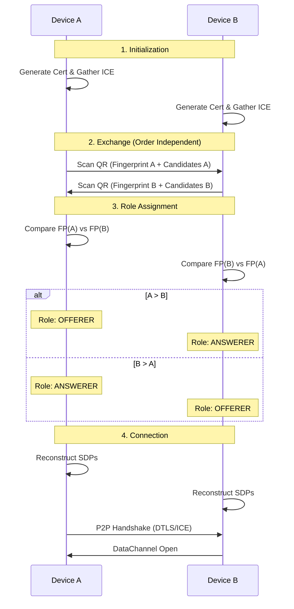

# QWBP - QR-WebRTC Bootstrap Protocol

> **Beta Software**: This library is in active development.
> The API may change between minor versions until v1.0.0.

[](https://www.npmjs.com/package/qwbp)
[](https://opensource.org/licenses/MIT)
[](https://creativecommons.org/licenses/by/4.0/)

**QWBP** (pronounced "cue-web-pee") is a binary protocol for establishing WebRTC DataChannel connections using QR codes as the signaling channel. It achieves a **97.79% reduction** in signaling payload size compared to standard SDP, enabling serverless peer-to-peer connections.

## Features

- **Serverless signaling** - No WebSocket servers, no backend infrastructure
- **Tiny payload** - 55-100 bytes fits in QR Version 4-5 (vs 2,487+ bytes for standard SDP)
- **Sub-second scanning** - Small QR codes scan reliably in under 500ms
- **Cryptographically secure** - HKDF-derived credentials, DTLS encryption
- **Universal browser support** - Works with Chrome, Safari, Firefox (including iOS)
- **Two-stage architecture** - Bootstrap enables full video/audio negotiation

## Installation

```bash
npm install qwbp
```

## Quick Start

```typescript
import { QWBPConnection } from "qwbp";

// Device A: Create connection and generate QR
const connectionA = new QWBPConnection();
await connectionA.initialize();
const qrData = connectionA.getQRPayload(); // Uint8Array for QR code

// Device B: Scan QR and create connection
const connectionB = new QWBPConnection();
await connectionB.initialize();
connectionB.processScannedPayload(scannedQrData);
const responseQrData = connectionB.getQRPayload();

// Device A: Process response and connect
connectionA.processScannedPayload(responseQrData);

// Both devices now have an encrypted DataChannel
connectionA.onDataChannel((channel) => {
  channel.send("Hello from A!");
});

connectionB.onDataChannel((channel) => {
  channel.onmessage = (e) => console.log("Received:", e.data);
});
```

## How It Works

### The Problem

Standard WebRTC signaling requires exchanging Session Description Protocol (SDP) messages—typically 2,500+ bytes. This data must travel through a signaling server (WebSocket, HTTP, etc.).

A full video call SDP is even larger: **6,255 bytes**—more than double the maximum QR code capacity (2,953 bytes for Version 40).

### The Solution

QWBP compresses WebRTC signaling to **55-100 bytes** by:

1. **Eliminating redundancy** - Only transmit what varies between sessions
2. **Binary encoding** - Raw bytes instead of text/JSON
3. **Deriving credentials** - ICE credentials derived via HKDF from DTLS fingerprint
4. **Symmetric exchange** - Both peers send identical "identity card" format

### Two-Stage Architecture

```
┌─────────────────────────────────────────────────────────────────┐
│  Layer 0: QR Bootstrap (QWBP)                                   │
│  • 55-100 bytes binary payload                                  │
│  • Fits in QR Version 4-5 (33-37 modules)                       │
│  • Establishes encrypted DataChannel                            │
└─────────────────────────────────────────────────────────────────┘
                              │
                              ▼
┌─────────────────────────────────────────────────────────────────┐
│  Layer 1: Application Protocol                                  │
│  • No size constraints                                          │
│  • Exchange full video/audio SDPs (6KB+)                        │
│  • Stream files of any size                                     │
└─────────────────────────────────────────────────────────────────┘
```

### Symmetric Identity Exchange Flow



## Protocol Specification

See [SPECIFICATION.md](./SPECIFICATION.md) for the complete RFC-level protocol specification, including:

- Binary packet format
- HKDF key derivation parameters
- SDP reconstruction templates
- Test vectors
- Security considerations

## API Reference

### `QWBPConnection`

Main class for establishing QWBP connections.

```typescript
const connection = new QWBPConnection(options?: QWBPOptions);
```

#### Options

| Option          | Type             | Default     | Description                       |
| --------------- | ---------------- | ----------- | --------------------------------- |
| `iceServers`    | `RTCIceServer[]` | Google STUN | ICE servers for NAT traversal     |
| `maxCandidates` | `number`         | `4`         | Maximum ICE candidates to include |
| `timeout`       | `number`         | `30000`     | Session timeout in milliseconds   |

#### Methods

| Method                        | Returns                   | Description                                       |
| ----------------------------- | ------------------------- | ------------------------------------------------- |
| `initialize()`                | `Promise<void>`           | Initialize connection and gather ICE candidates   |
| `getQRPayload()`              | `Uint8Array`              | Get binary payload for QR code                    |
| `processScannedPayload(data)` | `Promise<void>`           | Process scanned QR payload from peer              |
| `getDataChannel()`            | `RTCDataChannel \| null`  | Get established DataChannel                       |
| `getSAS()`                    | `Promise<string \| null>` | Get 4-digit verification code for MITM protection |
| `onDataChannel(callback)`     | `void`                    | Register callback for DataChannel ready           |
| `close()`                     | `void`                    | Close connection and cleanup                      |

### `QWBPEncoder`

Low-level encoder for QWBP packets.

```typescript
import { QWBPEncoder } from 'qwbp';

const payload = QWBPEncoder.encode({
  fingerprint: Uint8Array, // 32-byte SHA-256 DTLS fingerprint
  candidates: QWBPCandidate[]
});
```

### `QWBPDecoder`

Low-level decoder for QWBP packets.

```typescript
import { QWBPDecoder } from "qwbp";

const { fingerprint, candidates } = QWBPDecoder.decode(payload);
```

## Demo

A working demo is included in the `demo/` directory:

```bash
# Install dependencies
npm install

# Build demo
npm run build:demo

# Serve demo (use any static server)
npx serve demo
```

Open `demo/index.html` in two browser windows/devices to test QR-based signaling.

## Use Cases

- **File sharing** - Serverless AirDrop-like transfers
- **Game sync** - Transfer save data between devices
- **Device pairing** - IoT provisioning, smart home setup
- **Video calls** - Bootstrap channel for full SDP negotiation
- **Local multiplayer** - Mesh networking without game servers

## Browser Compatibility

| Browser        | Min Version | Status  | Notes                                  |
| -------------- | ----------- | ------- | -------------------------------------- |
| Chrome Desktop | 80+         | ✅ Full | Reference implementation               |
| Chrome Android | 80+         | ✅ Full | Camera permission reveals raw IP       |
| Safari Desktop | 14.1+       | ✅ Full | Privacy settings may affect candidates |
| Safari iOS     | 14.5+       | ✅ Full | Local Network prompt required          |
| Firefox        | 75+         | ✅ Full | Platform-dependent mDNS behavior       |
| Edge           | 80+         | ✅ Full | Chromium-based                         |

For detailed compatibility information, known issues, and workarounds, see [COMPATIBILITY.md](./COMPATIBILITY.md).

## Security

QWBP's security model relies on:

1. **Physical proximity** - QR scanning requires visual access
2. **DTLS encryption** - All data encrypted with ephemeral keys
3. **Fingerprint verification** - MITM prevention via certificate pinning
4. **Forward secrecy** - Session keys cannot decrypt past sessions

See [SPECIFICATION.md](./SPECIFICATION.md#security-considerations) for detailed threat analysis.

## Known Limitations

### No TURN Support in QR

QWBP is designed for **serverless** operation. TURN relay credentials cannot be transmitted in the QR code—they would exceed size limits and expose long-lived secrets.

**Impact:** If both peers are behind symmetric NATs (corporate firewalls, some cellular networks), STUN hole-punching will fail. Connection requires at least one peer with a reachable address.

**Workaround:** Applications requiring TURN support must pre-configure the same TURN server on both clients:

```typescript
const connection = new QWBPConnection({
  iceServers: [
    { urls: "stun:stun.l.google.com:19302" },
    {
      urls: "turn:your-turn-server.example.com:3478",
      username: "app-configured-user",
      credential: "app-configured-credential",
    },
  ],
});
```

### Network Requirements

- **Same Wi-Fi/LAN:** Works reliably with host candidates
- **Different networks:** Requires STUN-accessible srflx candidate (automatically included)
- **Both behind symmetric NAT:** Requires pre-configured TURN (see above)
- **iOS Local Network prompt:** Users may need to allow local network access

## Contributing

Contributions are welcome! Please read the specification before implementing changes.

```bash
# Run tests
npm test

# Run linter
npm run lint
```

## License

This project uses a dual-license structure:

- **Code (Library):** [MIT License](./LICENSE) — Use freely in any project, including commercial applications
- **Specification:** [CC BY 4.0](https://creativecommons.org/licenses/by/4.0/) — Share, adapt, and build upon the protocol design with attribution

## Acknowledgments

- Inspired by [Wi-Fi Easy Connect (DPP)](https://www.wi-fi.org/discover-wi-fi/wi-fi-easy-connect)
- Built on WebRTC standards from IETF and W3C
- Protocol design assisted by Claude (Anthropic)
